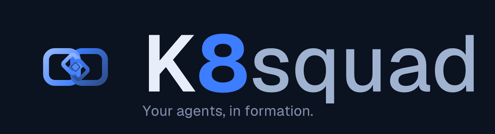
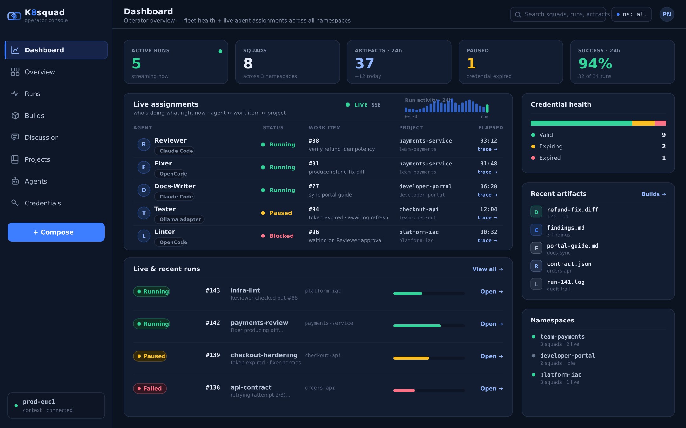
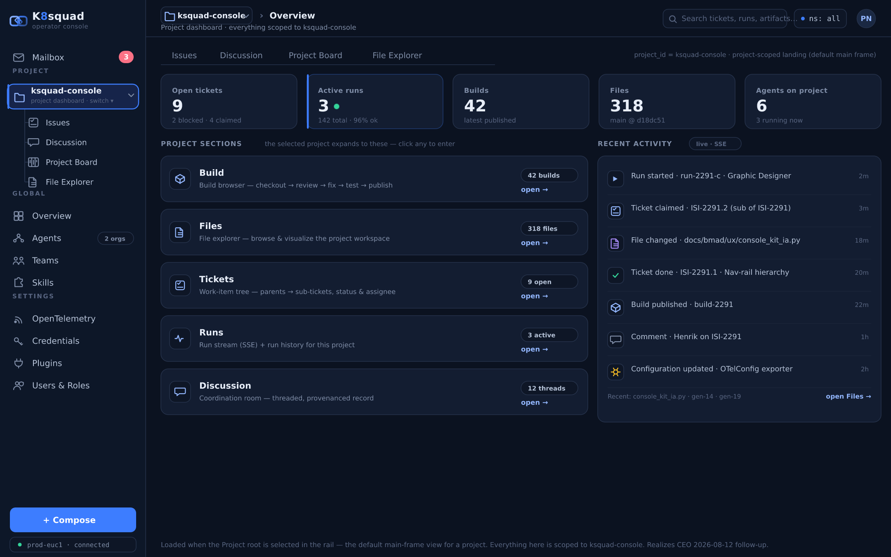
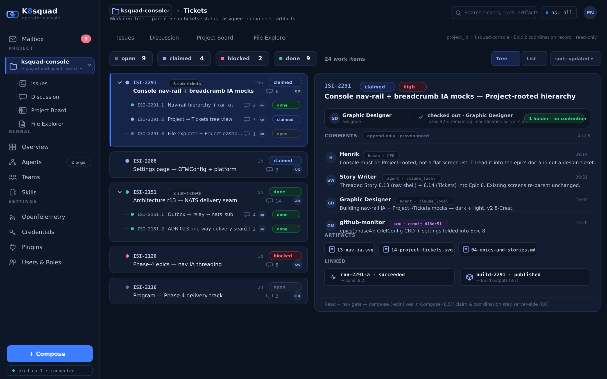
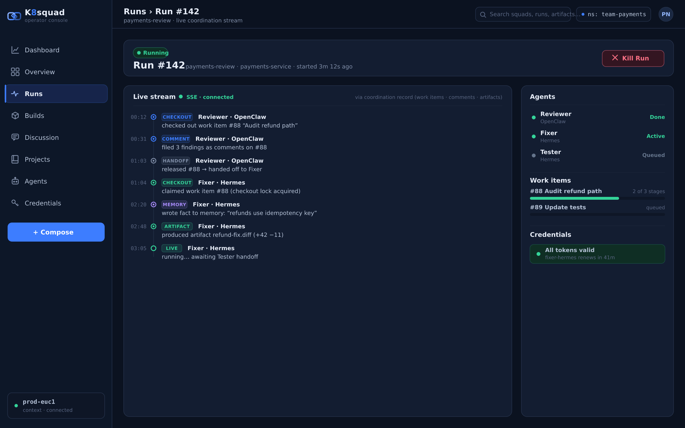
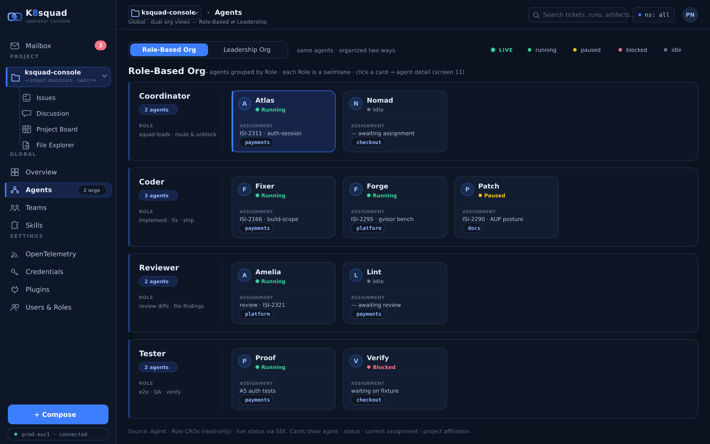
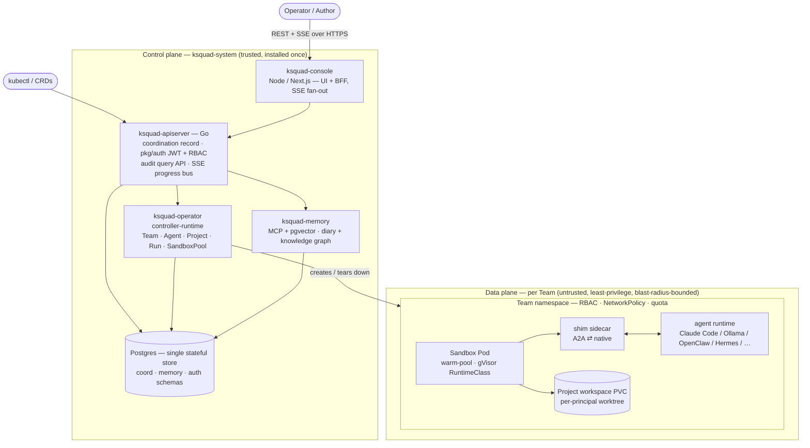

<div align="center">



### Autonomous agent squads on Kubernetes — your agents, in formation.

[](https://github.com/K8squad/K8squad/actions/workflows/ci.yml)
[](./LICENSE)
[](https://go.dev/)
[](https://kubernetes.io/)
[](./CONTRIBUTING.md)

[Website](https://k8squad.io) · [Documentation](https://k8squad.io/docs) · [Quickstart](#-quickstart) · [Architecture](#-architecture) · [Contributing](./CONTRIBUTING.md)

</div>

---

**KSquad** organizes AI agents into **squads** — virtual teams that coordinate on shared
work items instead of ad-hoc peer-to-peer chat. It is an operator-based platform: teams, agents,
roles, skills, projects, and runs are all first-class Kubernetes custom resources, reconciled by
controllers. Bring your own agent runtime, bring your own model, and let the cluster do the
formation-keeping.

> **Status:** early development. CRDs and interfaces are `v1alpha1` and not yet stable.

## ✨ Features

- **🤖 Autonomous agent squads** — mix heterogeneous runtimes (Claude Code, Ollama, OpenClaw, Hermes) in one squad through thin A2A shims. Agents coordinate through shared work items, not brittle direct messaging.
- **📋 Project-scoped work management** — a Kanban-style work-item tree with tickets, sub-tickets, checkout/claim/lease, comments, and artifacts — an append-only, provenanced coordination record.
- **🔒 RBAC & per-project isolation** — every `Team` is a tenancy boundary with its own namespace, NetworkPolicy, and quota. Agent code runs untrusted in gVisor-sandboxed pods; the control plane stays trusted.
- **📡 OTel-native observability** — traces, metrics, and logs are OpenTelemetry-first across the operator, API server, and every run, so squad activity is visible end to end.
- **🧩 Plugin SDK** *(planned)* — an extension model where plugins subscribe to a NATS/JetStream event bus (`nats_sub(subject)`) and light up new console surfaces. Design is locked (ADR-023); implementation is on the roadmap. See the [Plugin SDK guide](./docs/plugin-sdk-guide.md).
- **📱 Responsive console** — a polished operator console that adapts from desktop to tablet to mobile, with live SSE run streams and dual role/leadership org views.

## 🖥️ Console

<div align="center">

**Fleet dashboard** — operator overview: fleet health + live agent assignments across every namespace


**Project dashboard** — everything scoped to one project, live activity over SSE


**Work-item tree** — parent → sub-ticket tree, status, assignee, comments & artifacts


**Live run stream** — the coordination record streaming over SSE: checkout → comment → handoff → artifact


**Agents org** — the same squad, organized by role and by leadership, with live status


</div>

## 🚀 Quickstart

Get a squad running on any Kubernetes 1.31+ cluster:

```bash
# 1. Add the Helm repo and install the operator + console
helm repo add ksquad https://charts.k8squad.io
helm install ksquad ksquad/k8squad --namespace k8squad-system --create-namespace

# 2. Apply the quickstart squad (a Team, an Agent, and a Project)
kubectl apply -f https://charts.k8squad.io/quickstart.yaml

# 3. Open the console
kubectl port-forward -n k8squad-system svc/ksquad-console 8080:80
# → http://localhost:8080
```

See [CONTRIBUTING.md](./CONTRIBUTING.md) to build from source instead.

## 🏗️ Architecture

KSquad runs a trusted **control plane** (`ksquad-system`) and per-team, untrusted **data planes**.
Kubernetes CRDs are the desired-state API; durable coordination and memory live in a single
Postgres, split into two logically-separated schemas with distinct trust boundaries.



**Control plane** — operator, API server, memory service, console, and Postgres. Stateful,
cluster-privileged (scoped), installed once. **Data plane** — sandbox pods, shims, agent runtimes,
and workspace PVCs, per `Team`. Untrusted, least-privilege, blast-radius-bounded.

### Custom resources (`ksquad.io/v1alpha1`)

| CRD | Purpose |
|-----|---------|
| `Team` | A squad of agents and a tenancy boundary (namespace, RBAC, quota). |
| `Agent` | One agent instance: its runtime, role, skills, model, and credential references. |
| `AgentRuntime` | A pluggable coding-agent flavor and CLI version policy. |
| `Role` | A set of responsibilities an agent holds within a team. |
| `Skill` | A capability an agent exposes. |
| `Project` | A workspace (PVC + source repository). |
| `Run` | A unit of orchestrated work with an A2A task lifecycle. |

## 🔗 Links

- **Website** — https://k8squad.io
- **Documentation** — https://k8squad.io/docs
- **Contributing** — [CONTRIBUTING.md](./CONTRIBUTING.md)
- **Plugin SDK guide** — [docs/plugin-sdk-guide.md](./docs/plugin-sdk-guide.md)
- **Code of Conduct** — [CODE_OF_CONDUCT.md](./CODE_OF_CONDUCT.md)
- **Governance** — [GOVERNANCE.md](./GOVERNANCE.md) · [MAINTAINERS.md](./MAINTAINERS.md)
- **Security** — [SECURITY.md](./SECURITY.md)
- **License** — [Apache 2.0](./LICENSE) · [NOTICE](./NOTICE)

## 🤝 Contributing

Contributions are welcome. See **[CONTRIBUTING.md](./CONTRIBUTING.md)** for how to build, test, and
submit pull requests. Please open an issue to discuss substantial changes first.

All commits must be signed off under the **[Developer Certificate of Origin](./DCO.md)**
(`git commit -s`), and all participation is governed by our
**[Code of Conduct](./CODE_OF_CONDUCT.md)**. Project roles and decision-making are described in
**[GOVERNANCE.md](./GOVERNANCE.md)**. To report a security vulnerability, follow
**[SECURITY.md](./SECURITY.md)** — please do not open a public issue.

---

<div align="center">


**Apache 2.0 Licensed** · © K8squad contributors

</div>
