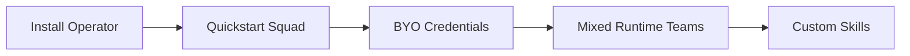
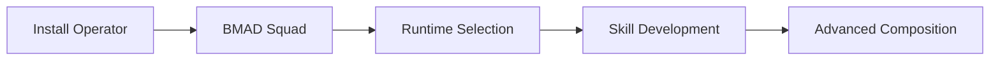
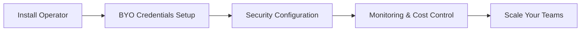

# Getting Started Guides

Welcome to the KSquad getting started documentation. Choose your path based on your needs and preferences.

## Quick Start Options

### 🚀 **For New Users**
- **[Quickstart Squad](../hack/quickstart/squad.yaml)** - The fastest way to get started with one agent
- **[BMAD Squad](../getting-started-bmad.md)** - Comprehensive 13-role team with predefined workflows

### 🔑 **For BYO Credentials**
- **[BYO Credentials (ChatGPT/OpenAI)](getting-started-byo-cred.md)** - Use your own API keys with Codex runtime

### 🧪 **For Different Runtimes**
- **[Codex Example](../../examples/codex/README.md)** - OpenAI's official Rust coding agent
- **[Supported Agent Runtimes](../supported-agents.md)** - Complete list of available runtimes

### 🏗️ **For Team Composition**
- **[Compose an Agent](../compose-an-agent.md)** - Learn how to build custom agents

## Path Recommendations

### For AI/ML Teams


### For Development Teams


### For Enterprise Users


## Core Concepts

### 1. Teams & Agents
- **Team**: Organizational boundary and namespace
- **Agent**: Individual AI team member with specific role
- **Role**: Defines responsibilities, behavior, and skills

### 2. Runtimes & Models
- **Runtime**: The AI model CLI (Claude Code, Codex, etc.)
- **Model**: Specific model version (GPT-4, Claude 3.5, etc.)
- **Credentials**: Authentication for AI services

### 3. Skills & Capabilities
- **Skill**: Extends agent capabilities with tools
- **Toolchain**: CLI tools available to agents
- **Permissions**: RBAC for secure access

## Step-by-Step Paths

### Path 1: Quick Setup (5 minutes)
```bash
# 1. Install operator
helm install ksquad ksquad/k8squad --namespace k8squad-system --create-namespace

# 2. Apply quickstart
kubectl apply -f https://charts.k8squad.io/quickstart.yaml

# 3. Open console
kubectl port-forward -n k8squad-system svc/ksquad-console 8080:80

# 4. Create your first run!
```

### Path 2: BYO OpenAI (15 minutes)
```bash
# 1. Install operator
helm install ksquad ksquad/k8squad --namespace k8squad-system --create-namespace

# 2. Follow BYO credentials guide
# (Complete setup with your API key)

# 3. Create Codex agent
# (Custom agent with your credentials)

# 4. Start using your OpenAI account
```

### Path 3: BMAD Team (30 minutes)
```bash
# 1. Install operator with tools
helm install ksquad ksquad/k8squad --namespace k8squad-system --create-namespace --set tools.defaultCatalog.enabled=true

# 2. Apply BMAD squad
kubectl apply -f examples/bmad-team/squad.yaml

# 3. Set credentials
kubectl -n bmad-squad edit secret model-credentials

# 4. Explore team structure
# (13 specialized agents working together)
```

## Configuration Templates

### Basic Agent Template
```yaml
apiVersion: ksquad.io/v1alpha1
kind: Agent
metadata:
  name: my-agent
  namespace: my-team
spec:
  roleRef:
    name: my-role
  runtimeRef:
    name: my-runtime
  credentialSecretRef:
    name: my-credentials
    key: token
```

### Team Template
```yaml
apiVersion: ksquad.io/v1alpha1
kind: Team
metadata:
  name: my-team
  namespace: my-team
spec:
  namespace: my-team
  description: "My custom AI team"
```

## Common Tasks

### Daily Use
- [Creating runs](../../README.md#-quickstart)
- [Monitoring progress](../bmad/ux/)
- [Managing credentials](../runbooks/credential-rotation.md)

### Maintenance
- [Rotating credentials](../runbooks/credential-rotation.md)
- [Updating runtimes](../supported-agents.md#runtime-updates)
- [Adding skills](../../CONTRIBUTING.md)

### Troubleshooting
- [Agent not starting?](../compose-an-agent.md#troubleshooting)
- [Network issues?](../../docs/getting-started-byo-cred.md#troubleshooting)
- [Credential problems?](../runbooks/credential-rotation.md)

## Advanced Topics

Once you're comfortable with the basics, explore:

- [Mixed runtime squads](../supported-agents.md#mixed-runtime-squads)
- [Skill development](../../CONTRIBUTING.md)
- [Console customization](../bmad/ux/)
- [API integration](../../plugin-sdk-guide.md)

## Support

- **Documentation**: Comprehensive guides for all features
- **Community**: Join our [Discord server](https://discord.gg/k8squad)
- **Issues**: Report bugs on [GitHub](https://github.com/K8squad/K8squad/issues)
- **Discussions**: Share experiences in [GitHub Discussions](https://github.com/K8squad/K8squad/discussions)

## Quick Reference

| Concept | Related Guide | Level |
|---------|---------------|-------|
| **Installation** | [Quickstart](../hack/quickstart/squad.yaml) | Beginner |
| **BYO Credentials** | [Getting Started BYO](getting-started-byo-cred.md) | Intermediate |
| **Team Building** | [BMAD Squad](../getting-started-bmad.md) | Intermediate |
| **Agent Composition** | [Compose an Agent](../compose-an-agent.md) | Advanced |
| **Runtime Selection** | [Supported Agents](../supported-agents.md) | Beginner |

Happy building your AI teams! 🤖
